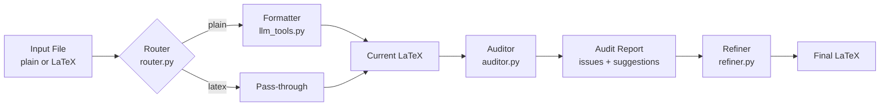

# AgentLatex

AgentLatex is a small agentic pipeline that turns plain text data or existing LaTeX tables into polished, publication-ready tables. It chains multiple tools router, formatter, auditor, and refiner to decide what your input needs and applies only the necessary fixes.

## Features
- **Router** (`router.py`): Classifies each input as plain text or LaTeX so the agent only runs the formatter when needed.
- **Formatter** (`llm_tools.py`): Converts raw text into a basic LaTeX table.
- **Auditor** (`auditor.py`): Parses the generated/loaded table, checks for caption/label/centering, validates column counts, detects missing tabular scaffolding or headers, and emits actionable suggestions.
- **Refiner** (`refiner.py`): Feeds the auditor report to Gemini and applies the requested fixes (booktabs, placeholders, repaired headers, etc.).
- **Output helper** (`main.py`): Saves each final table into `outputs/<name>.tex` so you can open or compile it later.
- **Safety guard**: Empty inputs exit early with a friendly error instead of generating random text.

## Requirements
1. Python 3.10+ (tested locally with recent CPython releases).
2. Packages listed in `requirement.txt` (install via `pip install -r requirement.txt`).
3. A Google Gemini API key stored in `.env` as `GEMINI_API_KEY=<your key>`.

## Getting Started
```bash
git clone <repo-url>
cd agent_learn
# create a virtual environment
python -m venv .venv
# activate it (macOS/Linux)
source .venv/bin/activate
# or on Windows (PowerShell)
.venv\Scripts\Activate.ps1
pip install -r requirement.txt
echo "GEMINI_API_KEY=..." > .env   # add your key
```

## Running the Agent
1. Put your input data in `input_plain.txt` (plain text) or `input_latex.txt` (raw LaTeX).
2. Run:
   ```bash
   python main.py
   ```
3. The script executes two demo runs (plain + LaTeX), prints the refined tables, and writes them to `outputs/output_plain.tex` and `outputs/output_latex.tex`.
4. Review the terminal logs to see router decisions and detailed auditor reports (issues + planned fixes).

### Example Inputs

**Plain text (`input_plain.txt`)**
```
Name,Math,Science,Total
Alice,85,90,175
Bob,70,65,135
```
*The router flags this as plain text, so the formatter builds an initial LaTeX table before auditing/refining.*

**LaTeX with issues (`input_latex.txt`)**
```
\begin{table}[h]
\tiny
Sales Q1 & 1200 & 1300 \\ \hline
Sales Q2 & 1500 & 1600 \\ \hline
\end{tabular}
\end{table}
```
*This version intentionally drops `\caption` , '
`\begin{tabular}` and `\label`, and it only uses plain `\hline` with no bold header row. The auditor flags the missing metadata, booktabs rules, and header, then the refiner adds placeholder caption/label text, upgrades the table styling, and inserts default headers when needed.*

### Example Output 
```
--- TEST 2: Reading from input_latex.txt ---
AGENT STARTED
[Router Tool]: Analyzing input type...
[Router Tool]: Decision is 'latex'
[Auditor Tool]: Results -> caption=False, label=False, centering=False, booktabs=False
[Auditor Tool]: Issues detected:
  - Caption missing.
  - Label missing.
  - Table is not centered.
  - Booktabs rules are incomplete.
  - Tabular environment missing.
  - Header row missing or not emphasized.
[Agent]: Auditor flagged these items before refinement:
  - Caption missing.
  - Label missing.
  - Table is not centered.
  - Booktabs rules are incomplete.
  - Tabular environment missing.
  - Header row missing or not emphasized.
[Refiner Tool]: Refining LaTeX...
AGENT STARTED

=== FINAL OUTPUT 2 ===

```latex
\begin{table}[htbp]
\centering
\tiny
\caption{Add your caption here}
\label{Add your label here}
\begin{tabular}{lrr}
\toprule
\textbf{Column 1} & \textbf{Column 2} & \textbf{Column 3} \\
\midrule
Sales Q1 & 1200 & 1300 \\ 
Sales Q2 & 1500 & 1600 \\ 
\bottomrule
\end{tabular}
\end{table}
```
[Output]: LaTeX saved to outputs/output_latex.tex
```

## Flowchart


### Handling Empty Inputs
If a file is empty or whitespace-only, the agent stops immediately and prints `Error: No input data provided.` This prevents random generations.

## How It Works Internally
1. **Routing** – `run_router` uses Gemini to classify the input.
2. **Formatting** – If the input is plain text, `run_formatter` builds a basic table.
3. **Auditing** – `audit_latex_table` inspects the table, flags missing pieces (caption, label, `\begin{tabular}`, headers, etc.), and prepares placeholder header names when needed.
4. **Refinement** – `run_refiner` receives both the table and the audit report, enforcing booktabs usage, inserting “Add your caption/label here” placeholders, rebuilding tabular scaffolds, and filling in default headers like `Column 1`, `Column 2`, ...


## TODO / Ideas
- Log every agent step (router → formatter → auditor → refiner) to JSON and feed the summaries into future runs so the agent “learns” what usually goes wrong.
- Implement a controller/planning loop that can rerun tools or stop early based on audit results instead of following a fixed order.
- Add a scratchpad/memory file so later prompts know which issues were already addressed.
- Auto-tune prompts/heuristics by analyzing the logs (e.g., tighten formatting rules when column mismatches are frequent).
- Introduce meta-tools/escalation: when the refiner fails twice, call a troubleshooting helper or surface actionable guidance to the user.

## Troubleshooting
- **`GEMINI_API_KEY` missing**: Ensure `.env` is loaded or export the variable before running.
- **Random output with malformed inputs**: Check the auditor log; it explains what was missing and what placeholders were added.


AgentLatex is intentionally minimal, use it as a learning scaffold for building more capable LLM-driven agents.
